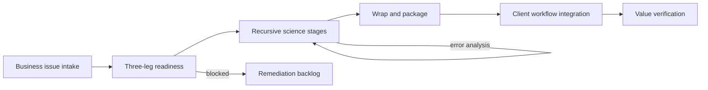

# Caseloom

**Source:** `ai-in-enterprise/ML_and_More_V9_isitc_Dec4_2017_final/`
**Domain:** `ai-enterprise`
**One-liner:** An applied ML use-case factory that industrializes Deloitte’s three-legged stool—assets, people, and process—into repeatable cognitive use cases from business problem framing through packaged models in production workflows.
**Wedge:** Professional-services-led or enterprise CoE programmes that can name business problems (retention, fraud, complaints, pricing) but stall between data-science prototypes and engineered production packages.
**Positioning:** Use-case factory, not a generic “AI platform.” Caseloom encodes the Cognitive Advantage spectrum (process automation → cognitive automation → insights → engagement), the recursive data-science process, and the wrap-and-integrate pattern proven on high-volume classification workloads.

## Market research synthesis

### Thesis from source

Brian Ray’s Deloitte “Demystifying Artificial Intelligence delivered by Data Science” deck argues that AI is finally past winter hype, but making ML real at scale remains elusive because organizations treat it as a technology purchase rather than a **three-legged stool: Assets, People, and Process**. Assets are data, tools, and platforms—including hard-to-reach unlabeled, non-machine-readable, and poor-quality data plus external purchased/free sets. People require blended teams of data scientists, engineers, SMEs, analysts, and UX—not unicorn hunting. Process must respect that data science is **recursive** (EDA → features → modeling → selection → error analysis → ensembling), unlike business waterfall or even standard engineering iteration.

The deck’s four-tier analytics ladder clarifies ambition: traditional statistical modeling; advanced ML; predictive (wired for real-time, possibly retraining); and **cognitive/AI** that combines two or more predictive models to mimic human thinking. Deloitte’s Cognitive Advantage spectrum spans process automation (rules/RPA), cognitive automation (comprehension of documents), cognitive insights (probabilistic decision support), and cognitive engagement (systems that replicate interaction). Business issues mapped to ML include customer retention/acquisition, pricing, part expiration, insurance risk, real-time fraud, shop-floor optimization, and regulation reform.

The implementation pattern is explicit: (1) data scientists interactively build models with familiar tools; (2) models are **wrapped and packaged** for deployment; (3) packages integrate into client systems for real-time prediction. The complaint-system example is the proof point: **133 models** in a resource-limited environment, each over **370,000 narratives**, nearly **50,000,000 predictions in under 2.5 hours**, accuracy **70–90%**, versus an estimated **31,000 human reading hours**. That is the factory economics Caseloom productizes: intake a business problem, assemble the three legs, run the recursive science loop, package, integrate, and measure against a human or baseline cost.

Organizations fail when stakeholders do not buy in, scientists cannot communicate value, test data is unreliable, skills are missing, or no business case exists. Caseloom’s job is to make those failure modes visible gates inside the factory, not post-mortem excuses.

### Buyer & economic model

- **Primary buyer:** Managing Director / Partner leading a cognitive or analytics offering, or enterprise Head of AI CoE funding a pipeline of applied use cases.
- **Users:** engagement leads, data scientists, ML engineers, business SMEs, process owners, client success / value office, risk reviewers.
- **Budget owner / value metric:** transformation or CoE P&L. Value metric is use cases promoted to production per quarter, time from problem intake to packaged integration, and verified hours/cost avoided vs. manual baseline (as in the complaints example).
- **Competing status quo:** slideware cognitive frameworks, one-off notebooks that never get wrapped, and RPA projects that never climb the spectrum to insights/engagement.

### Domain constraints

- **Regulatory / trust / safety:** complaint, fraud, insurance, and regulation-reform use cases imply explainability, human review, and audit of model ensembles.
- **Data sensitivity:** narratives, contracts, customer and employee data; unlabeled sets may still be personal data.
- **Change-management realities:** business sponsors fear the recursive science loop looks like lack of control—factory stages and exit criteria are required. Engineers and scientists work on different cadences; packaging is the contract between them.

## Business requirements

- BR-1: Every use case must start from a named business issue and target Cognitive Advantage tier (automation, comprehension, insights, engagement) before modeling begins.
- BR-2: Intake must score the three legs—Assets, People, Process—and block build if any leg is below an agreed readiness threshold.
- BR-3: The factory must support the recursive data-science stages as first-class work objects with re-entry (error analysis can send work back to features or data processing).
- BR-4: Data asset plans must distinguish owned, cross-BU, purchased, free external, unlabeled, and non-machine-readable sources with remediation tasks.
- BR-5: Blended staffing (scientist, engineer, SME, analyst, UX as needed) must be assigned per phase; unicorn-only staffing plans are not acceptable for stage promotion.
- BR-6: Models that leave the lab must be wrapped into versioned packages suitable for engineering deployment—interactive notebooks alone cannot be marked “done.”
- BR-7: Production integration must define the client workflow touchpoint and prediction SLA (batch or real-time) before packaging completes.
- BR-8: Value cases must estimate and later verify baseline human or process cost (hours, error rate, cycle time) comparable to the complaints ROI narrative.
- BR-9: Multi-model cognitive solutions must record which predictive components compose the cognitive behavior and how conflicts are resolved.
- BR-10: Business-case and stakeholder buy-in artifacts are required gates; lack of sponsor communication of value is a tracked risk, not a soft skill aside.
- BR-11: Accuracy, precision/recall, or F1 (as appropriate) plus resource cost of inference must be reported for factory throughput decisions.
- BR-12: Audit exports must show data lineage, team composition, stage history, and package versions for regulated use cases.

## User stories

Canonical user stories live in sibling [USER_STORIES.md](USER_STORIES.md).

## System design

### Overview

Caseloom runs a factory lifecycle: problem intake → three-leg readiness → recursive science workspace → wrap/package → production integration → value verification. Cognitive tier and business-issue taxonomy guide templates (e.g., text classification for complaints). The system does not replace training frameworks; it orchestrates people, assets, and process gates around them and records the packages that enter client workflows.

### Actors & boundaries

- **Actors:** CoE/engagement leads, data scientists, engineers, SMEs, sponsors, risk/value officers, external client systems.
- **Trust boundary:** Caseloom holds use-case metadata, stage evidence, and package references. Sensitive corpora may remain in client data planes with references and quality scores only in the factory.
- **Human-in-the-loop points:** readiness exceptions, cognitive-tier changes, low-confidence prediction review, go-live approval, kill decisions.

### Core capabilities

1. **Use-case intake & taxonomy** — business issues × cognitive spectrum.
2. **Three-leg readiness** — assets, people, process scoring and blockers.
3. **Recursive science workspace** — stage objects with re-entry and metrics.
4. **Asset sourcing planner** — owned/external/unlabeled remediation backlog.
5. **Team composition manager** — blended roles per phase.
6. **Wrap & package** — scientist artifact → engineered package.
7. **Production integration registry** — workflow touchpoints and SLAs.
8. **Value verification** — baseline vs. actual hours/cost/quality.
9. **Audit & lineage** — stage history, models, packages, data references.

### Conceptual data

- **Primary entities:** UseCase, BusinessIssue, CognitiveTier, ReadinessScore, AssetPlan, TeamAssignment, ScienceStage, ModelComponent, Package, IntegrationEndpoint, ValueBaseline, ValueActual, AuditTrail.
- **Critical events:** intake submitted, readiness passed/failed, stage re-entered, package wrapped, integration live, value verified, use case killed.
- **Retention / audit needs:** full stage and package history for regulated domains; personal data references minimized; metrics retained for portfolio benchmarking.

### Integrations (conceptual)

- **Systems of record:** client CRM/complaint systems, data lakes, model training tools, container registries, ITSM for integration tickets.
- **Upstream signals:** data-quality reports, labeled dataset availability, staffing calendars.
- **Downstream actions:** deployment tickets, sponsor dashboards, invoiceable value reports for services firms, retraining triggers from error analysis.

### High-level architecture

### Success metrics

- **Leading:** % use cases passing three-leg readiness on first try; median days in each science stage; wrap success rate; package-to-integration lead time.
- **Lagging:** production use cases per quarter; verified hours/cost avoided; accuracy bands achieved under resource limits; reduction in zombie prototypes; sponsor NPS / repeat funding rate.

## OpenAPI skeleton

Canonical HTTP surface lives in sibling [openapi.yaml](openapi.yaml). Summary:

- **Base path:** `/v1/...`
- **Auth:** `X-API-Key` for integrations; Bearer JWT for operators.
- **Resource groups:** UseCases, Readiness, ScienceStages, Packages, Integrations, Value.
