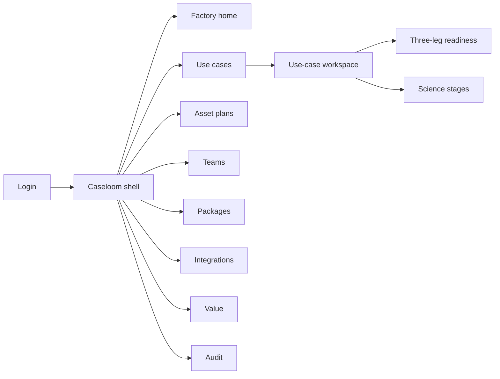
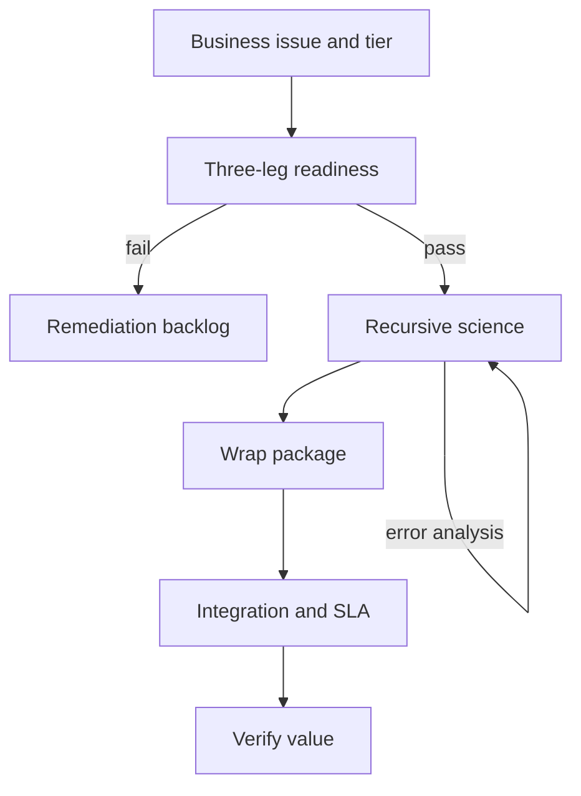

# Caseloom — Web app

**Product:** [PRODUCT.md](./PRODUCT.md)
**Primary surface:** Applied ML use-case factory console (CoE / engagement lead shell)
**Secondary surfaces:** Sponsor value briefing (read-only); package artifact browser for engineers
**Design thesis:** Caseloom is a factory floor for cognitive use cases — assets, people, and process as three load-bearing legs — not a notebook gallery. The UI metaphor is a loom: business issues warp onto a Cognitive Advantage spectrum; recursive science stages weave with visible re-entry loops; wrap-and-package is the shuttle that turns scientist work into something engineering can ship. Visual language is warm clay panels on deep umber rails with loom-copper highlights for packaged versions and amber for stage re-entry — recursive work looks intentional, not broken. Complaints-scale throughput (hours avoided vs human baseline) is the hero metric, never “models trained.”

## UX research synthesis

### Category peers (best-in-class)

- **Dataiku / Domino Project workspaces:** End-to-end project with roles and promotion gates. Steal: blended team roles per phase and promotion blocked without package; reject notebook-first home that hides business issue and cognitive tier.
- **MLflow + custom packaging UIs (Databricks Model Serving setup):** Artifact → registered model → serving. Steal: wrap acceptance criteria as explicit engineer contract; reject treating registry as proof of production value.
- **Jira Align / factory kanban for delivery orgs:** Stage aging and rework visibility. Steal: recursive stage objects with re-entry edges (error analysis → features); reject linear waterfall boards that punish science loops.
- **Deloitte-style cognitive spectrum frameworks (productized):** Automation → engagement ladder. Steal: tier selection before modeling; reject slide-only frameworks without three-leg readiness gates.

### Patterns to adopt / reject

- **Adopt:** Business-issue + cognitive-tier intake; three-leg readiness blockers; recursive science stages; asset source taxonomy (owned/external/unlabeled); blended staffing; wrap/package gate; integration SLA before package done; value baseline vs verified hours; multi-model composition; audit lineage.
- **Reject:** Unicorn-only staffing plans; notebook = done; RPA projects labeled as engagement; hiding rework; purple AI; zombie prototypes without kill.

### Trust, density, and workflow constraints from PRODUCT.md

Sensitive corpora stay in client data planes — Caseloom holds references and scores (trust boundary). Regulated use cases need lineage exports (BR-12). Three-leg below threshold blocks build (BR-2). Notebooks cannot mark done without wrap (BR-6). Sponsor buy-in is a hard gate (BR-10). Value must verify against human baseline (BR-8).

## Information architecture

### Nav model

### Roles → default home

| Role | Default home | Why |
|------|--------------|-----|
| CoE / engagement lead | Factory home | Throughput and zombie aging |
| Data scientist | Science stages on assigned cases | Recursive loop visibility (BR-3) |
| ML engineer | Packages / Integrations | Wrap and SLA (BR-6, BR-7) |
| Business SME / process owner | Use-case workspace — outcomes | Define “good” + human review |
| Risk / value office | Value + Audit | Hours avoided + lineage (BR-8, BR-12) |
| Sponsor | Value briefing | Buy-in and kill decisions (BR-10) |

### Cross-links to OpenAPI resources

| Nav area | OpenAPI tags / resources |
|----------|---------------------------|
| Use cases | UseCases |
| Three-leg readiness | Readiness |
| Science stages | ScienceStages |
| Packages | Packages |
| Integrations | Integrations |
| Value baselines/actuals | Value |

## Screen inventory

### Factory home

- **Purpose:** Answer “is the factory shipping packaged use cases or hoarding prototypes?”
- **Entry:** Default for CoE lead.
- **Layout regions:** Brand + period; throughput (production promotions); stage-aging heatmap; readiness fail queue; value verified strip; alerts (sponsor risk, wrap backlog).
- **Primary actions:** Intake use case; kill zombie; open aged stage.
- **Empty / loading / error:** Empty = intake first business issue; loading = skeleton; error = retry with request id.
- **BR / story ties:** Factory throughput metrics; BR-10.

### Use-case intake

- **Purpose:** Name business issue and Cognitive Advantage tier before any modeling.
- **Entry:** Create use case.
- **Layout regions:** Issue taxonomy (retention, fraud, complaints, pricing…); spectrum picker (automation → engagement); sponsor field; template hint (e.g. text classification).
- **Primary actions:** Submit intake; save draft.
- **Empty / loading / error:** Missing tier or issue = cannot proceed to readiness.
- **BR / story ties:** BR-1.

### Use-case workspace

- **Purpose:** Single loom view: legs, stages, packages, integration, value.
- **Entry:** From list or home.
- **Layout regions:** Header (issue, tier); readiness summary; science stage strip with re-entry marks; package status; integration touchpoint; value baseline/actual; kill control.
- **Primary actions:** Advance when gates pass; request wrap; verify value; kill.
- **Empty / loading / error:** Blocked leg = coral banner listing remediation.
- **BR / story ties:** BR-1–BR-8.

### Three-leg readiness

- **Purpose:** Score Assets, People, Process; block build below threshold.
- **Entry:** Use-case → Readiness.
- **Layout regions:** Three score columns; blocker list; exception request (audited).
- **Primary actions:** Rescore; open remediation; grant exception.
- **Empty / loading / error:** Below threshold = build locked (BR-2).
- **BR / story ties:** BR-2.

### Asset plan

- **Purpose:** Distinguish owned, cross-BU, purchased, free, unlabeled, non-machine-readable sources with remediation.
- **Entry:** Nav → Assets or readiness drill.
- **Layout regions:** Source table with type; quality/remediation tasks; external purchase flags.
- **Primary actions:** Add source; assign remediation; mark ready.
- **Empty / loading / error:** No assets = readiness fail on Assets leg.
- **BR / story ties:** BR-4.

### Team composition

- **Purpose:** Blended staffing per phase — reject unicorn-only plans.
- **Entry:** Nav → Teams; readiness People leg.
- **Layout regions:** Phase × role matrix (scientist, engineer, SME, analyst, UX); gap warnings.
- **Primary actions:** Assign people; flag unicorn-only plan as invalid for promotion.
- **Empty / loading / error:** Missing engineer on wrap phase = block package.
- **BR / story ties:** BR-5.

### Recursive science workspace

- **Purpose:** First-class stages with re-entry — EDA → features → modeling → selection → error analysis → ensembling.
- **Entry:** Use-case → Science.
- **Layout regions:** Stage kanban with back-edges; metrics (accuracy/F1, inference cost); ensemble composition panel; re-entry reason log.
- **Primary actions:** Complete stage; re-enter prior stage; record model components.
- **Empty / loading / error:** Linear-only view toggle off by default — re-entry always visible.
- **BR / story ties:** BR-3, BR-9, BR-11.

### Wrap and package

- **Purpose:** Scientist artifact → versioned deployable package; notebooks alone cannot be done.
- **Entry:** Science complete CTA; Nav → Packages.
- **Layout regions:** Acceptance criteria from engineering; wrap job status; package version; artifact refs.
- **Primary actions:** Start wrap; accept/reject package; compare versions.
- **Empty / loading / error:** Notebook-only submit = rejected with criteria checklist.
- **BR / story ties:** BR-6.

### Production integration

- **Purpose:** Client workflow touchpoint and prediction SLA (batch/real-time) before package completes.
- **Entry:** Nav → Integrations; package gate.
- **Layout regions:** System touchpoint; SLA; human-review path for low confidence; ITSM ticket link.
- **Primary actions:** Declare integration; confirm SLA; enable go-live.
- **Empty / loading / error:** Missing SLA = wrap incomplete (BR-7).
- **BR / story ties:** BR-7.

### Value verification

- **Purpose:** Estimate then verify baseline human/process cost — complaints ROI narrative as pattern.
- **Entry:** Nav → Value; sponsor briefing.
- **Layout regions:** Baseline hours/error/cycle; actuals post go-live; variance; export.
- **Primary actions:** Set baseline; post actuals; publish briefing.
- **Empty / loading / error:** No baseline = cannot claim factory value.
- **BR / story ties:** BR-8.

### Audit and lineage

- **Purpose:** Data lineage, team composition, stage history, package versions for regulated cases.
- **Entry:** Nav → Audit.
- **Layout regions:** Timeline; package graph; export pack.
- **Primary actions:** Export audit; freeze version set.
- **Empty / loading / error:** Missing lineage refs = incomplete pack warning.
- **BR / story ties:** BR-12.

## Key flows

1. **Intake to build** — business issue + tier → three-leg readiness → blended team → science; failure: any leg below threshold.

2. **Wrap contract** — engineer criteria → wrap job → accept package → block notebook-done (BR-6).

3. **Recursive re-entry** — error analysis sends work to features/data → stage history retained (BR-3).

4. **Value verify** — baseline human hours → production → actuals → sponsor briefing (BR-8).

5. **Kill on buy-in/test-data failure** — gate fail → kill → free budget (BR-10).

## Design system

### Tokens (CSS variables)

- `--color-ink: #2A2118` — primary text
- `--color-clay: #F3EBE3` — app ground
- `--color-panel: #FFFaf6` — panels
- `--color-umber: #4A3428` — rails/chrome
- `--color-copper: #B87333` — packaged / shipped
- `--color-amber: #D4891A` — re-entry / provisional
- `--color-coral: #C4574A` — readiness block / kill
- `--color-teal: #3A7A6A` — value verified
- `--color-brand: #B87333` — Caseloom wordmark
- `--font-display: "Literata", serif` — use-case titles (workshop memo feel)
- `--font-body: "Manrope", sans-serif` — factory chrome
- `--font-mono: "IBM Plex Mono", monospace` — package versions, stage ids
- `--space-1`…`--space-8`: 4px scale
- `--radius-sm: 4px`; `--radius-md: 8px`
- `--motion-reentry: 240ms ease-in-out` — back-edge stage animation
- `--motion-wrap: 200ms ease-out` — package accept flash
- `--motion-leg: 180ms ease-out` — readiness score settle
- Atmosphere: subtle warp/weft line texture; copper rules under packages; no brain stock art.

### Typography & brand

- Literata for case names and cognitive tier; Manrope for boards; mono for versions.
- Brand in shell on factory views; login: brand + “From business problem to packaged prediction” + one CTA.

### Do / don’t

- **Do:** Show re-entry loops; require three legs; force wrap before done; verify hours avoided; record ensemble composition.
- **Don’t:** Purple AI; linear-only science UI; unicorn staffing; notebook=production; hide zombies.

### Accessibility & domain trust cues

- Stage re-entry announced via live region + text “Returned to features.”
- Readiness legs use labels + scores, not colour alone.
- Focus order: intake → readiness → science → wrap → integrate → value.

## Component patterns

- **CognitiveTierPicker** — automation → engagement.
- **ThreeLegScore** — assets/people/process with blockers.
- **ScienceStageBoard** — recursive stages with back-edges.
- **AssetSourceTaxonomy** — owned/external/unlabeled types.
- **BlendedTeamMatrix** — roles per phase.
- **WrapAcceptancePanel** — engineer criteria checklist.
- **PackageVersionCard** — interaction container for accept/reject.
- **ValueBaselineActual** — hours/cost verification pair.
- **ModelEnsembleMap** — multi-model composition + conflict rules.
- **LineageAuditExport** — regulated pack builder.

## Out of scope for v1 web

- Training IDE / notebook runtime; client complaint-system replacement; full HR staffing tools; native mobile factory apps; public AutoML marketplace; multi-tenant client white-label beyond engagement scoping.
